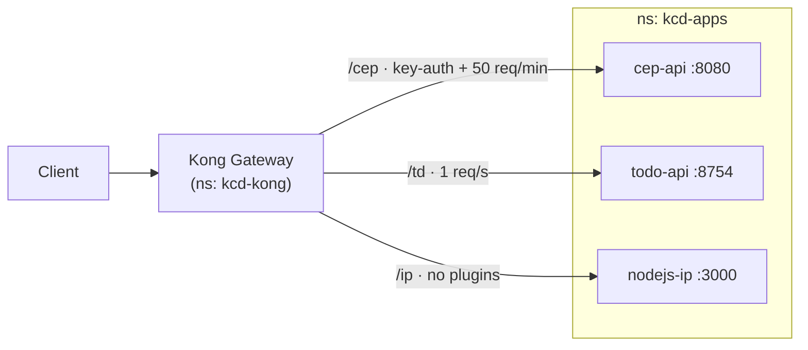

# KCD Lima — API Gateway with Kong on Kubernetes

Demo project for [KCD Lima](https://community.cncf.io/kcd-lima/) showing the **API Gateway pattern** on Kubernetes with [Kong](https://konghq.com/). Three small APIs are exposed through a single Kong gateway that handles routing, API-key authentication, and rate limiting — all declared with Kubernetes resources (`Ingress`, `KongPlugin`, `KongConsumer`).

The same manifests run in two environments:

- **Local** — [KIND](https://kind.sigs.k8s.io/) cluster (1 control-plane + 3 workers)
- **Cloud** — GKE cluster on Google Cloud, provisioned with Terraform

## Architecture



| Service | Image | Port | Route | Plugins |
|---------|-------|------|-------|---------|
| CEP API (postal codes) | `kenesparta/cep-api` | 8080 | `/cep` | key-auth + rate limit (50/min per credential) |
| Todo API (Rust) | `kenesparta/rs-simple-todo` | 8754 | `/td` | rate limit (1/s per IP) |
| IP API (Node.js) | `kenesparta/nodejs-ip` | 3000 | `/ip` | none |

## Repository layout

```
k8s/        Kubernetes manifests + Makefile (Kong, apps, KIND config)
terraform/  GKE cluster, VPC, NAT and firewall rules (Google Cloud)
tests/      Go integration/load tests against the deployed APIs
```

## Prerequisites

- `docker`, `kind`, `kubectl`, `helm`, `make`
- `terraform` and the `gcloud` CLI (cloud path only)
- Go 1.23+ (tests only)

## Run it locally (KIND)

```bash
cd k8s
cp .env.example .env   # set API_KEY

make kind-init             # create KIND cluster "kong-kcd"
make install-kic           # Gateway API CRDs + Kong GatewayClass/Gateway
make install-kong          # install Kong via Helm into ns kcd-kong
make apps-setup            # create ns kcd-apps + API-key secret
make deploy-cep-api
make deploy-todo-api
make deploy-nodejs-ip-api
```

The KIND config (`k8s/kind-local/clusterconfig.yaml`) maps ports 80, 443, and 49412 from the control-plane node to the host.

## Deploy to Google Cloud (Terraform + GKE)

```bash
cd terraform
cp .env.example .env   # set TF_VAR_project_name

make dev/init      # terraform init with GCS backend (bucket kcd-lima)
make dev/plan
make dev/apply
```

This creates:

- GKE cluster `kcd-cluster-a` in `us-central1-c` with a node pool of **e2-standard-2 spot instances**, autoscaling 5–10 nodes
- VPC `kcd-vpc` with a `10.0.0.0/16` subnet, Cloud Router + NAT gateway, and firewall rules

Point `kubectl` at the new cluster:

```bash
gcloud container clusters get-credentials kcd-cluster-a \
  --zone us-central1-c \
  --project kdc-lima
```

Then install Kong and deploy the apps with the same `k8s/` make targets as the local path (skip `kind-init`). Tear everything down with `make dev/destroy`.

## Try the APIs

Get the gateway address — on GKE it's the LoadBalancer IP of the Kong proxy:

```bash
EXTERNAL_IP=$(kubectl get svc -n kcd-kong kong-gateway-proxy \
  -o jsonpath='{.status.loadBalancer.ingress[0].ip}')
```

```bash
# open endpoint
curl "http://$EXTERNAL_IP/ip"

# rate-limited: more than 1 req/s returns 429
curl -X POST "http://$EXTERNAL_IP/td/todos" \
  -H 'Content-Type: application/json' \
  -d '{"title":"demo","completed":false}'

# key-auth: without the key returns 401, above 50 req/min returns 429
curl "http://$EXTERNAL_IP/cep/01023-001" -H "apikey: $API_KEY"
```

## Load tests

Go tests in `tests/` fire real traffic at the deployed gateway:

```bash
cd tests
cp .env.example .env   # set EXTERNAL_IP and API_KEY

go test -run Test_todoRequest -v   # 100 POSTs to the Todo API
go test -run Test_cepRequest -v    # 100 concurrent GETs to the CEP API
go test -run Test_ipRequest -v     # 10,000 concurrent GETs to the IP API
```
